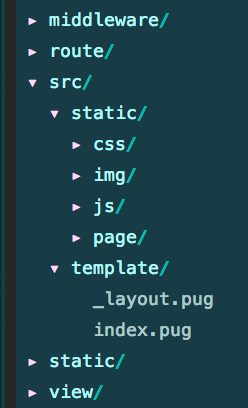
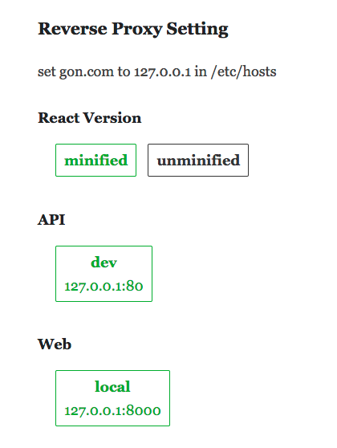

# Gon

Not meer another f2e build tool.


### Convention

#### Folder Structure



#### File Name

The module file which will be imported (stylus) or required (js) to the entry file should be named start with the `_` prefix. 

Command

#### Gon create [Project's Name]

Creates a new project, generates all the folders and files.

#### Gon dev

Starts the proxy server and the project, with javascript, stylus and pug files processed by Webpack and Gulp.

Should be used with `sudo`, because the proxy server runs on port `80`.

#### Gon release

Releases all the static files to the `static` folder and all template files to the `view` folder.

### Custom Config

```javascript
// config.js
module.exports = {
  domain: 'gon.com',
  port: 8000,
  // web server  
  // request to the upper domain will be proxyed to these servers
  fe: {
    local: '127.0.0.1:8000',
    dev: '',
    pre: '',
    pro: '',
  },
  // api server
  // requests to `/api` will be prxoyed to these servers
  be: {
    dev: '127.0.0.1:80',
    pre: '',
    pro: '',
  },
  proxy: {
    // proxy a project's request to an outiside server
    '/data/sk/101010100.html': 'www.weather.com.cn:80',
    // proxy an outside request to project
    '2pmh9.free.natapp.cc': '/ping',
  },
  // used for webpack to avoid compiling these files
  externals: {
    react: 'React',
    'react-dom': 'ReactDOM',
  },
}
```

### Switch Proxy Setting

You can switch all these proxy setting on  [http://localhost/](http://localhost/).

